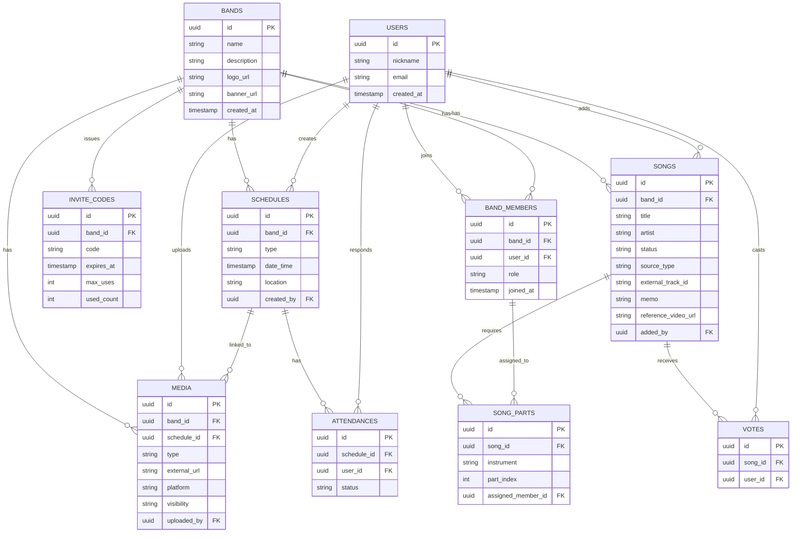
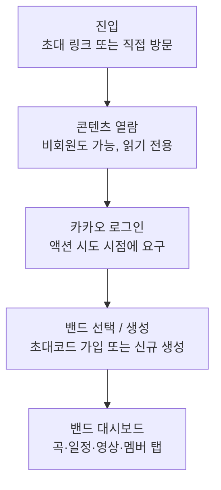
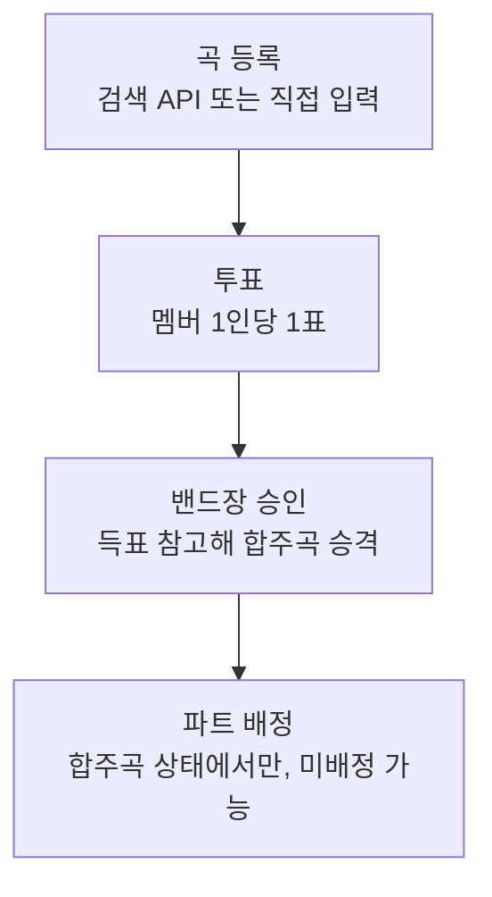
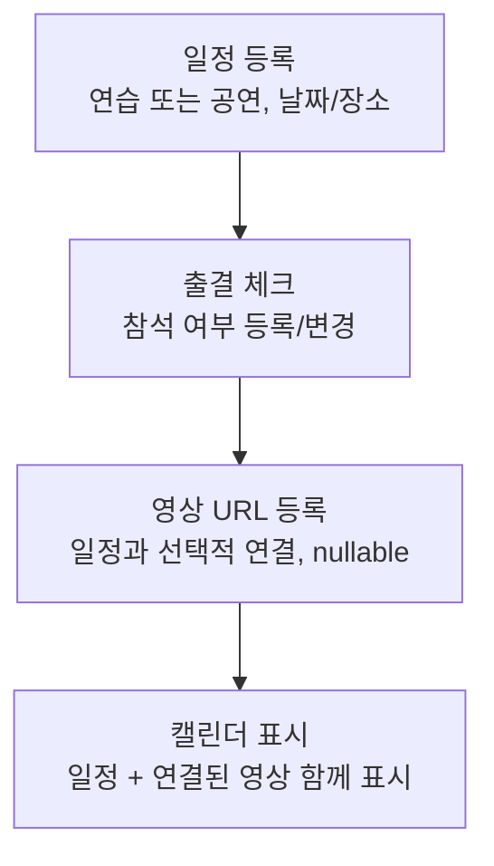

# 밴디브(Bandive) 프로젝트 기획

## 0. 서비스명
- **밴디브 (Bandive)** — Band + Archive 합성어로 확정

## 1. 개요
- **목적**: 노션(Notion) 대체용, 밴드 전용 아카이브형 커뮤니티 서비스
- **핵심 컨셉**: 밴드를 생성하고 멤버를 초대해, 합주곡 리스트/일정/구성원/영상을 한곳에서 관리
- **핵심 기능 목록**
  - 밴드 생성 및 멤버 초대
  - 밴드 커스터마이징 (이름, 로고, 배너)
  - 합주곡 리스트
  - 연습 날짜 / 공연 날짜 일정
  - 밴드 구성원 관리
  - 공연 영상 / 합주 영상 아카이브
  - 합주곡 위시리스트

## 2. 방향성 (확정)
| 항목 | 결정 |
|---|---|
| 우선 목표 | 실제 밴드 대상 소규모 배포 |
| 플랫폼 | 웹 (반응형) |
| 핵심 차별화 포인트 | 합주영상/공연영상 아카이브 (메타데이터 기반 정리·검색) |
| 초기 목표 규모 | 지인 밴드 몇 개 (10팀 이하) |
| 밴드 초대 방식 | 초대 코드/링크 방식 |

## 3. 경쟁 서비스 조사 요약
- **BandHelper, BANDZONE** (해외): 세트리스트 배포, 리허설 노트, 정산 등 종합 밴드 운영 툴
- **브레멘, 합주하자** (국내): 합주 파트너 매칭 중심, 아카이브 성격은 약함
- 완전히 동일한 조합의 서비스는 확인되지 않았으며, "아카이브 특화 + 노션 대체"라는 포지셔닝은 틈새(niche)로 판단됨

## 4. 영상 저장 방식 (논의 후 변경)
- 최초 검토안: 자체 업로드 (S3 등 오브젝트 스토리지)
- 문제점: 장기적 저장 비용 리스크, 유튜브/카카오톡/구글드라이브 대비 뚜렷한 차별점 부재
- **최종 결정: 자체 호스팅 대신 URL 첨부 방식** (유튜브/구글드라이브 링크 등)
  - 저장 비용 리스크를 서비스가 아닌 외부 플랫폼이 부담
  - 핵심 가치(밴드·곡·일정과 연결된 아카이브 정리·검색)는 URL 방식으로도 유지 가능
  - 향후 필요 시 자체 업로드를 선택적으로 확장 가능하도록 데이터 모델에 platform 구분값 반영 예정

## 5. 확정된 세부 결정사항

### 5.1 권한 모델
- 밴드장(Owner) / 사용자(Member) 2단계 역할 구조 (관리자 역할 제외, 3단계에서 변경)

### 5.2 합주곡 위시리스트 운영 방식
- 누구나 곡 추가 가능
- 곡 등록 방식 2가지
  - 곡 검색: 외부 음원 API(Spotify 등)에서 검색해 등록
  - 직접 입력: 제목/아티스트를 수동으로 입력
- 곡 등록 시 추가 입력 필드: 비고/메모, 세션 구성(악기별 필요 인원, 예: 드럼1/기타2/건반1/보컬1), 참고 영상
- 투표(좋아요 방식)는 멤버 1인당 1회만 가능
- 최종 승격은 자동이 아닌, 득표 수를 참고해 밴드장이 수동 승인
- 파트 배정(세션별 담당 멤버 매핑)은 합주곡(CONFIRMED) 상태에서만 가능, 미배정(null) 허용
- 파트 배정 권한: 로그인한 멤버 누구나 가능 (밴드장 전용 아님, 기존 결정에서 변경)

### 5.3 로고 / 배너
- 이미지 파일 직접 업로드 지원 (영상과 달리 자체 스토리지 부담이 적어 업로드 방식 채택)

### 5.4 일정(Schedule) 기능
- 캘린더 뷰 제공
- 참석 여부 체크(출결) 기능 포함
- 캘린더에서 일정에 연결된 영상 목록도 함께 표시 (일정-영상 연결은 선택 사항, 미연결 허용)

### 5.5 배포 환경
- 클라우드 플랫폼: AWS
- 도메인: 무료 서브도메인으로 우선 테스트 (정식 도메인 구매는 추후 검토)

### 5.6 UI 화면 흐름
- 홈 대시보드 + 하단 탭바 구조 (모바일형 네비게이션)
- 한 사용자가 여러 밴드에 속할 수 있으므로 밴드 전환(switcher) 버튼 UI 추가

### 5.7 영상 공개 범위 정책
- 밴드별로 공개 범위를 직접 설정 가능 (예: 밴드 멤버만 열람 vs 링크 소지자 열람)
- 영상은 특정 일정(Schedule)과 선택적으로 연결 가능 (미연결 허용)

### 5.8 회원가입 / 로그인 방식
- 카카오 소셜 로그인 방식 채택

### 5.9 비회원 기능 범위
- 비회원도 전체 콘텐츠 열람 가능
- 투표, 댓글 등 액션(action)은 로그인 필요

### 5.10 CI/CD 파이프라인
- 자동 배포까지 구축 (push 시 AWS까지 자동 반영)

### 5.11 기술 스택
- 백엔드: Spring Boot + JPA + PostgreSQL + Redis (기존 숙달 스택 활용)
- 클라우드/배포: AWS, Docker

### 5.12 보류된 논의 (2단계 확장 후보)
- 밴드 팔로우(구성원 아닌 구경) 기능: 데이터 구조만 여지 남기고 UI는 보류
- 전체공개 밴드 탐방 랜딩페이지: 콜드 스타트 문제로 이번 MVP 범위에서 제외, 공개 밴드가 충분히 쌓인 뒤 재검토

## 6. 결정 필요 사항 (진행 중)
- (현재 없음 — 추가 논의 필요 시 갱신)

## 7. 데이터 스키마 (ERD)

### USERS
- id (PK), nickname, email, created_at

### BANDS
- id (PK), name, description, logo_url, banner_url, created_at

### BAND_MEMBERS (User ↔ Band 다대다 연결)
- id (PK), band_id (FK), user_id (FK), role (OWNER/MEMBER), joined_at

### INVITE_CODES
- id (PK), band_id (FK), code, expires_at, max_uses, used_count

### SONGS
- id (PK), band_id (FK), title, artist, status (WISHLIST/CONFIRMED), source_type (SEARCH/MANUAL), external_track_id (nullable, 외부 음원 API 트랙 ID), memo, reference_video_url, added_by (FK, User)

### SONG_PARTS (곡의 세션 구성 및 파트 배정)
- id (PK), song_id (FK), instrument (DRUM/GUITAR/KEYBOARD/VOCAL/BASS 등), part_index (동일 악기 내 순번, 예: 기타1/기타2), assigned_member_id (FK, BandMember, nullable — 합주곡 상태일 때만 배정)

### VOTES (Song ↔ User 다대다 연결, 좋아요 방식, 1인 1표)
- id (PK), song_id (FK), user_id (FK)

### SCHEDULES
- id (PK), band_id (FK), type (REHEARSAL/PERFORMANCE), date_time, location, created_by (FK, User)

### ATTENDANCES (Schedule ↔ User 다대다 연결)
- id (PK), schedule_id (FK), user_id (FK), status (참석/불참/미정)

### MEDIA
- id (PK), band_id (FK), schedule_id (FK, nullable — 특정 일정과 선택적 연결), type (REHEARSAL/PERFORMANCE), external_url, platform, visibility (밴드별 설정), uploaded_by (FK, User)

### 관계 요약
- User 1:N BandMember N:1 Band (다대다 관계 매핑)
- Band 1:N InviteCode / Song / Schedule / Media
- Song 1:N Vote, User 1:N Vote (다대다 매핑, 곡당 사용자 1표 제한은 유니크 제약으로 처리)
- Song 1:N SongPart, BandMember 1:N SongPart (파트 배정, assigned_member_id는 nullable)
- Schedule 1:N Attendance, User 1:N Attendance (다대다 매핑)
- Schedule 1:N Media (선택적 연결, schedule_id nullable)

## 8. API 엔드포인트 설계

### 8.1 인증
| Method | Endpoint | 설명 | 인증 필요 |
|---|---|---|---|
| GET | /api/auth/kakao/callback | 카카오 로그인 콜백 처리, 세션/토큰 발급 | X |
| POST | /api/auth/logout | 로그아웃 | O |
| POST | /api/auth/refresh | 토큰 재발급 | O |

### 8.2 밴드
| Method | Endpoint | 설명 | 인증 필요 |
|---|---|---|---|
| POST | /api/bands | 밴드 생성 | O |
| GET | /api/bands/{bandId} | 밴드 상세 조회 | X |
| GET | /api/bands/my | 내가 속한 밴드 목록 | O |
| PATCH | /api/bands/{bandId} | 밴드 정보 수정 (이름/설명) | O (밴드장) |
| POST | /api/bands/{bandId}/logo | 로고 이미지 업로드 | O (밴드장) |
| POST | /api/bands/{bandId}/banner | 배너 이미지 업로드 | O (밴드장) |

### 8.3 초대
| Method | Endpoint | 설명 | 인증 필요 |
|---|---|---|---|
| POST | /api/bands/{bandId}/invite-codes | 초대 코드 발급/재발급 | O (밴드장) |
| POST | /api/invite-codes/{code}/join | 초대 코드로 밴드 가입 | O |

### 8.4 밴드 멤버
| Method | Endpoint | 설명 | 인증 필요 |
|---|---|---|---|
| GET | /api/bands/{bandId}/members | 멤버 목록 조회 | X |
| DELETE | /api/bands/{bandId}/members/{userId} | 멤버 추방 | O (밴드장) |
| DELETE | /api/bands/{bandId}/members/me | 밴드 탈퇴 | O |

### 8.5 곡 (위시리스트 / 합주곡 리스트)
| Method | Endpoint | 설명 | 인증 필요 |
|---|---|---|---|
| GET | /api/songs/search?q= | 외부 음원 API(예: Spotify) 곡 검색 | X |
| GET | /api/bands/{bandId}/songs?status= | 곡 목록 (위시리스트/확정 필터) | X |
| POST | /api/bands/{bandId}/songs | 곡 추가 (검색 결과 선택 또는 직접 입력, 메모/세션구성/참고영상 포함) | O |
| POST | /api/songs/{songId}/vote | 투표 (1인 1표) | O |
| DELETE | /api/songs/{songId}/vote | 투표 취소 | O |
| PATCH | /api/songs/{songId}/confirm | 합주곡으로 승격 | O (밴드장) |
| PUT | /api/songs/{songId}/parts/{partId}/assign | 파트 배정/해제 (합주곡 상태에서만, 미배정 가능) | O (로그인 멤버 누구나) |
| DELETE | /api/songs/{songId} | 곡 삭제 | O (밴드장) |

### 8.6 일정
| Method | Endpoint | 설명 | 인증 필요 |
|---|---|---|---|
| GET | /api/bands/{bandId}/schedules | 일정 목록 (캘린더 뷰용, 연결된 영상 포함) | X |
| POST | /api/bands/{bandId}/schedules | 일정 등록 | O |
| PATCH | /api/schedules/{scheduleId} | 일정 수정 | O |
| DELETE | /api/schedules/{scheduleId} | 일정 삭제 | O (밴드장) |
| POST | /api/schedules/{scheduleId}/attendance | 참석 여부 등록/변경 | O |

### 8.7 미디어 (영상)
| Method | Endpoint | 설명 | 인증 필요 |
|---|---|---|---|
| GET | /api/bands/{bandId}/media?scheduleId= | 영상 목록 조회 (일정별 필터 가능, 공개범위 적용) | X (공개 설정에 따라 제한) |
| POST | /api/bands/{bandId}/media | 영상 URL 등록 (scheduleId 선택 입력) | O |
| PATCH | /api/media/{mediaId}/visibility | 공개 범위 변경 | O (밴드장) |
| DELETE | /api/media/{mediaId} | 영상 삭제 | O |

## 9. 기능 플로우

### 9.1 진입 및 인증 흐름

1. 진입 (초대 링크 또는 직접 방문)
2. 콘텐츠 열람 (비회원도 가능, 읽기 전용)
3. 카카오 로그인 (액션 시도 시점에 요구)
4. 밴드 선택 / 생성 (초대코드로 가입 또는 신규 생성)
5. 밴드 대시보드 (곡·일정·영상·멤버 탭)

### 9.2 곡 위시리스트 흐름

1. 곡 등록 (검색 API 또는 직접 입력, 메모/세션구성/참고영상 포함)
2. 투표 (멤버 1인당 1표)
3. 밴드장 승인 (득표 참고해 합주곡으로 승격)
4. 파트 배정 (합주곡 상태에서만 가능, 미배정 허용)

### 9.3 일정·영상 연결 흐름

1. 일정 등록 (연습/공연, 날짜/장소)
2. 출결 체크 (참석 여부 등록/변경)
3. 영상 URL 등록 (일정과 선택적 연결, nullable)
4. 캘린더 표시 (일정 + 연결된 영상 함께 표시)

## 10. ADR (Architecture Decision Records)

### ADR-001. 영상 저장 방식: 자체 호스팅 대신 URL 첨부
- **상태**: 승인됨
- **배경**: 초기에는 S3 자체 업로드를 검토했으나, 트랜스코딩·스토리지 장기 비용 리스크가 있고 유튜브/카카오톡/구글드라이브 대비 뚜렷한 차별점을 만들기 어려움
- **결정**: 영상은 자체 저장 없이 외부 URL(유튜브/구글드라이브 등)만 저장. Media.external_url 필드로 관리
- **결과**: 저장 비용이 사실상 0에 수렴. 대신 원본 화질 보존이나 링크 영속성은 보장하지 못함. 데이터 모델에 platform 구분값을 남겨 추후 자체 업로드로 확장 가능하도록 설계

### ADR-002. 권한 모델: 3단계 → 2단계로 변경
- **상태**: 승인됨 (수정됨)
- **배경**: 최초에는 밴드장/관리자/멤버 3단계로 설계했으나, 이후 밴드장/사용자 2단계로 단순화 요청
- **결정**: BAND_MEMBERS.role은 OWNER/MEMBER 두 값만 가짐
- **결과**: 권한 체크 로직이 단순해짐. 다만 밴드장 부재 시 위임할 관리자가 없어 병목 가능성 있음 (장기 검토 필요)

### ADR-003. 백엔드 기술 스택: Spring Boot 채택
- **상태**: 승인됨
- **배경**: Django와 비교 검토. 이 프로젝트의 핵심 난이도는 역할 기반 접근 제어와 카카오 OAuth 연동이며, 개발자가 이미 Spring Boot/JPA/PostgreSQL/Redis 스택에 숙달되어 있음
- **결정**: Spring Boot + Spring Data JPA + PostgreSQL + Redis
- **결과**: 기존 ERD·API 설계를 바로 구현으로 옮길 수 있음. Django의 관리자 페이지 자동 생성 같은 이점은 포기

### ADR-004. 밴드 가입 방식: 초대 코드/링크 전용
- **상태**: 승인됨
- **배경**: 공개 검색/가입이 아닌 지인 기반 소규모 밴드(10팀 이하) 대상 서비스
- **결정**: 밴드 가입은 InviteCode(코드/링크)를 통해서만 가능. 공개 밴드 목록에서 바로 가입하는 기능은 없음
- **결과**: 폐쇄적이고 안전한 그룹 형성이 가능하나, 신규 사용자 확보 채널로는 기능하지 않음

### ADR-005. 비회원 접근 정책: 콘텐츠 전체 열람 허용
- **상태**: 승인됨
- **배경**: 서비스 확산 및 공유 편의성을 고려해, 링크를 받은 비회원도 내용을 바로 볼 수 있어야 한다는 요구
- **결정**: 모든 GET(조회) 엔드포인트는 비인증 허용. 투표·등록·수정 등 액션(POST/PATCH/DELETE)만 카카오 로그인 요구
- **결과**: 공유 링크로 유입되는 사용자 경험이 좋아짐. 다만 밴드별 영상 공개 범위(5.7) 설정과 충돌하지 않도록 Media 조회는 visibility 값에 따라 예외적으로 제한

### ADR-006. 공개 밴드 탐방 랜딩페이지 및 팔로우 기능: 보류
- **상태**: 보류 (2단계 검토 대상)
- **배경**: 콜드 스타트 문제 — 목표 규모가 지인 밴드 10팀 이하인 시점에는 "공개 밴드 탐방"이나 "팔로우"가 체감되는 콘텐츠가 부족함
- **결정**: 이번 MVP 범위에서는 UI로 노출하지 않음. 다만 Band.visibility, BandFollow 같은 데이터 구조 확장 여지는 남겨둠
- **결과**: MVP 개발 범위 축소. 공개 밴드 수가 늘어난 시점에 재논의 필요

### ADR-007. 파트 배정 권한: 밴드장 전용 → 로그인 멤버 누구나로 변경
- **상태**: 승인됨 (수정됨)
- **배경**: 최초 API 설계(8.5)에는 밴드장만 파트 배정 가능하도록 명시했으나, 프론트엔드 목업 구현 과정에서 "로그인한 멤버 누구나 배정 가능"으로 이미 동작 중이었고, 실제로도 세션 구성은 멤버 간 자율 조율 영역에 가까워 밴드장 승인까지 거칠 필요가 낮다고 판단
- **결정**: `PUT /api/songs/{songId}/parts/{partId}/assign`은 로그인한 멤버 누구나 호출 가능하도록 변경 (합주곡 상태에서만 가능하다는 제약은 유지)
- **결과**: 프론트 목업과 백엔드 정책이 일치. 다만 멤버 간 배정 충돌(동시에 같은 파트에 서로 다른 사람을 배정) 처리 로직은 구현 시 별도로 고려 필요

### ADR-008. 카카오 로그인 시 이메일 미수집
- **상태**: 승인됨 (기존 ERD 대비 수정)
- **배경**: 카카오 로그인에서 이메일(account_email)을 필수 동의항목으로 받으려면 카카오 비즈 앱 전환과 별도 심사가 필요함. 사용자 식별은 이미 kakao_id(고유값)로 충분하고, 10팀 규모 서비스에서 이메일 기반 알림·계정복구 기능의 필요성이 낮음
- **결정**: USERS 테이블은 email 대신 kakao_id(unique)를 식별자로 사용. 이메일은 수집하지 않음
- **결과**: 비즈 앱 전환·심사 절차 없이 카카오 로그인 즉시 사용 가능. 추후 이메일 기반 알림 등이 필요해지면 그 시점에 비즈 앱 전환을 별도로 진행

### ADR-009. 밴드 description 필드 추가 및 로고/배너 업로드 시점
- **상태**: 승인됨
- **배경**: API 설계(8.2)에는 "이름/설명 수정"이 명시되어 있었으나 ERD에는 description 필드가 누락되어 있었음. 또한 로고/배너 업로드 API가 Band 도메인(Phase 4)에 포함되어 있는데, StorageService 추상화는 Phase 5로 예정되어 있어 시점이 어긋남
- **결정**:
  - BANDS 테이블에 description 필드 추가
  - 로고/배너 업로드는 Phase 4(밴드 도메인)에서 로컬 디스크 임시 구현으로 먼저 진행하고, Phase 5에서 StorageService 추상화 도입 시 S3로 교체
- **결과**: 문서 간 불일치 해소. Phase 4 범위에 임시 파일 저장 로직이 포함되므로, Phase 5에서 해당 부분을 StorageService 인터페이스로 교체하는 리팩터링이 필요함을 로드맵에 남겨둠

---
*최종 수정: 2026-08-28*